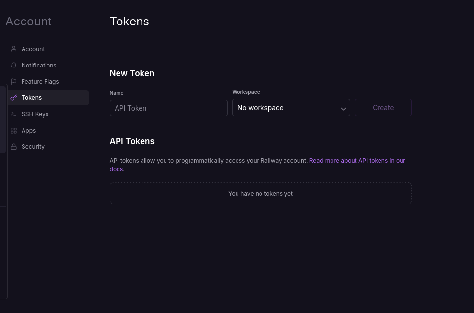
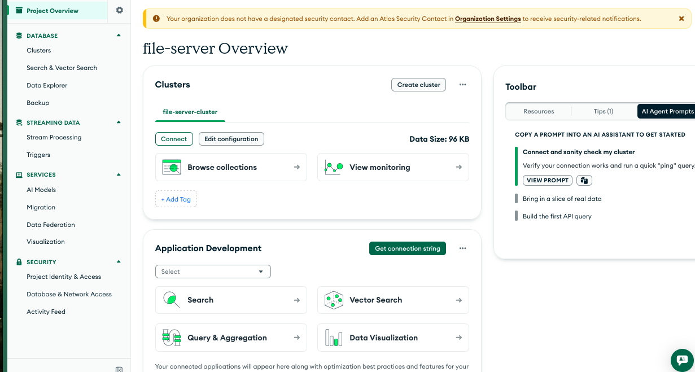
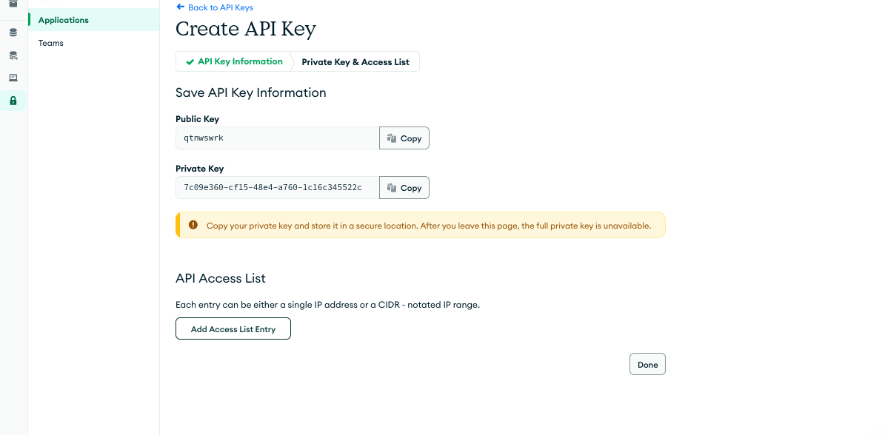
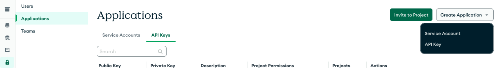
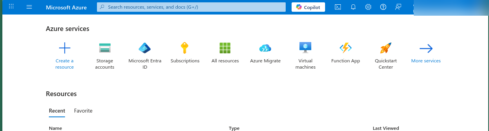
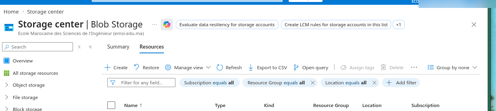
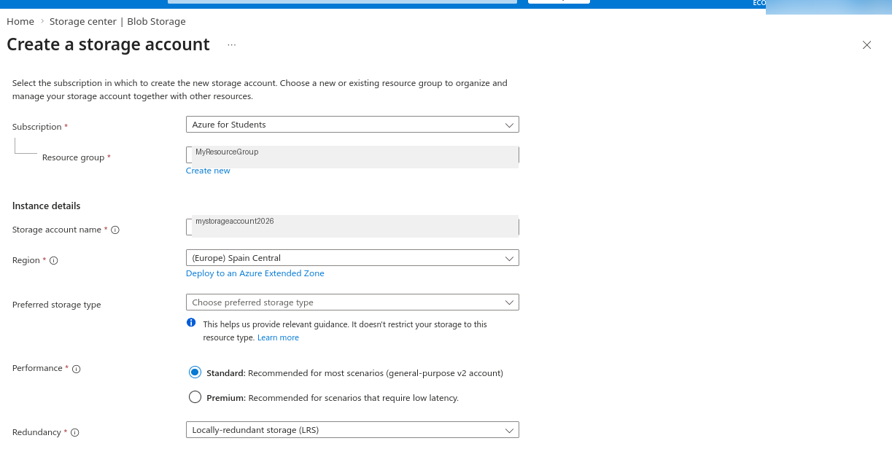
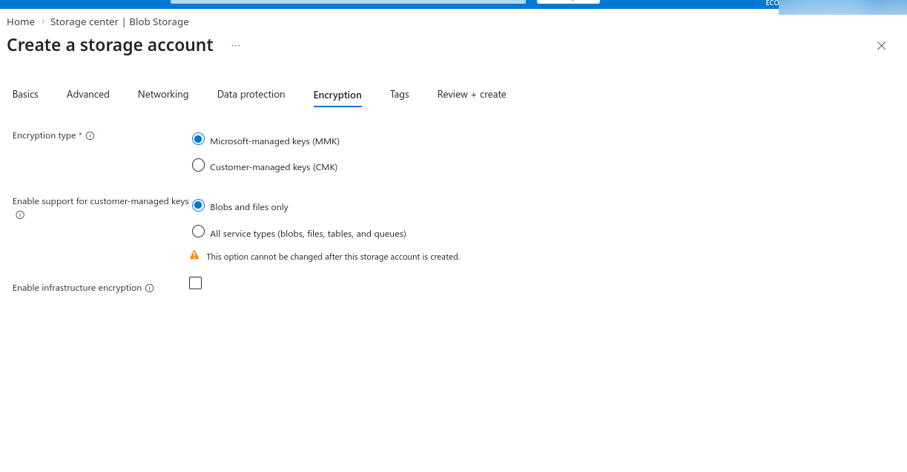
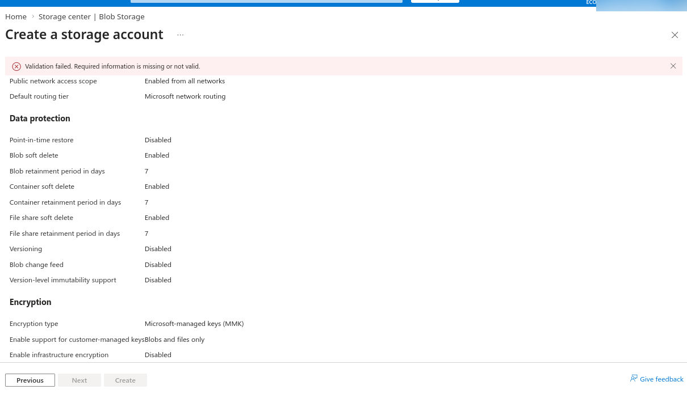
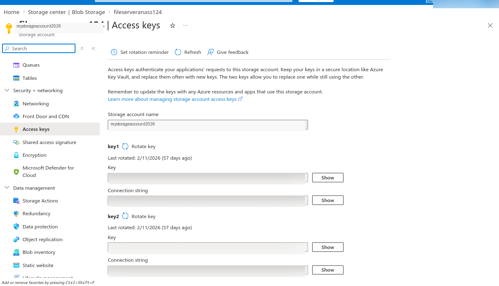

# 🏰 Bartizan — Zero-Knowledge Encrypted File Server

<p align="center">
  
  
  
  
  
  
</p>

> **The most secure self-hosted file server ever built. Your files are unreadable — even if the server gets hacked.**

---

## 📋 Table of Contents

- [Why Bartizan?](#why-bartizan)
- [How It Compares](#how-it-compares)
- [Security Architecture](#security-architecture)
- [Security Details](#security-details)
- [Tech Stack](#tech-stack)
- [API Reference](#api-reference)
- [Deployment](#deployment)
  - [Prerequisites](#prerequisites)
  - [Part 1 — Railway API Token](#part-1--railway-api-token)
  - [Part 2 — MongoDB Atlas API Keys](#part-2--mongodb-atlas-api-keys)
  - [Part 3 — Azure Storage Account](#part-3--azure-storage-account)
  - [Credentials Summary](#credentials-summary)
  - [Running the Deploy Command](#running-the-deploy-command)
- [Security Reminders](#security-reminders)

---

## Why Bartizan?

Traditional file hosts (Dropbox, Google Drive, etc.) store your files in plaintext. The server operator can read everything. If hackers breach the server, they get all your files. Third parties can snoop on your data.

**Bartizan changes that.**

- 🔒 **Zero-Knowledge** — the server never sees unencrypted data. Ever.
- 🚀 **Self-Deployed** — deploy to your own cloud infrastructure with one command
- 🎲 **No Enumeration** — files stored with random UUIDs, discoverable only with your API key
- 🛡️ **Military-Grade Encryption** — AES-256-GCM with a unique IV generated per file
- 🔑 **Hash-Only Key Storage** — only a SHA-256 hash of your API key is stored; even a stolen database cannot be used to authenticate

---

## How It Compares

| Feature | Dropbox / Google Drive | **Bartizan** |
|---------|------------------------|--------------|
| **Who can read your files** | The provider + any attacker who breaches them | Nobody — not even the server operator |
| **Deployment** | Their servers, their rules | Your own cloud, fully under your control |
| **Encryption model** | Server-side (they hold the key) | Zero-knowledge (only you hold the key) |
| **API Key storage** | Plaintext or reversible | SHA-256 hash only — irreversible |
| **Filenames on disk** | Original or guessable | Random UUIDs — no information leakage |
| **File enumeration** | Anyone with access can list files | Requires valid API key |

---

## Security Architecture

```
┌──────────────┐     TLS      ┌──────────────────────┐     SAS      ┌───────────────────┐
│  Flutter App │ ──────────▶ │     Node.js API       │ ──────────▶ │   Azure Blob      │
│  (Bartizan)  │   (HTTPS)   │   + AES-256-GCM       │   Tokens    │   Storage         │
│              │             │                       │             │                   │
│ PIN/Biometric│             │  • Hash API Key       │             │  [ENCRYPTED FILE] │
│ + Local      │             │  • Rate Limiting      │             │   + UUID Name     │
│   Encryption │             │  • Helmet headers     │             │                   │
└──────────────┘             └──────────────────────┘             └───────────────────┘
                                          │
                                          ▼
                               ┌──────────────────────┐
                               │       MongoDB         │
                               │     (Metadata)        │
                               │                       │
                               │  filename:  UUID only │
                               │  encrypted: true      │
                               │  owner:     key hash  │
                               └──────────────────────┘
```

**Data flow:**
1. The Flutter client encrypts the file locally with AES-256-GCM before it ever leaves the device
2. The encrypted blob is transmitted over TLS to the Node.js API
3. The API authenticates the request using only the SHA-256 hash of the API key
4. The encrypted blob is stored in Azure with a random UUID filename — no original filename is preserved
5. Metadata (UUID, hash, timestamp) is stored in MongoDB — never the file content or original name
6. Download reverses the process; decryption happens on the client

---

## Security Details

| Property | Implementation |
|----------|----------------|
| **Encryption algorithm** | AES-256-GCM |
| **IV (Initialization Vector)** | Randomly generated per file |
| **API key format** | `rf_live_<24 random hex characters>` |
| **API key storage** | SHA-256 hash only — the raw key is never persisted |
| **Rate limiting** | 100 requests / 15 min globally · 20 requests / 15 min for uploads |
| **File naming** | Random UUID — original filename never stored |
| **Transport security** | TLS (HTTPS) enforced |
| **HTTP hardening** | Helmet.js (security headers) |
| **File storage** | Azure Blob Storage, accessed via short-lived SAS tokens |
| **Metadata storage** | MongoDB (separate attack surface from file storage) |

---

## Tech Stack

| Layer | Technology |
|-------|-----------|
| **Backend API** | Node.js, Express, Helmet, express-rate-limit |
| **Database** | MongoDB (metadata only — no file content) |
| **File Storage** | Azure Blob Storage (encrypted blobs) |
| **Frontend** | Next.js |
| **Mobile** | Flutter |
| **Deployment** | Railway (one-command automated CLI deploy) |

---

## API Reference

All endpoints require the `X-API-Key` header with a valid key in the format `rf_live_<24 hex chars>`.

| Method | Endpoint | Description |
|--------|----------|-------------|
| `POST` | `/api/upload` | Upload an encrypted file |
| `GET` | `/api/file/:name` | Retrieve file metadata by UUID |
| `GET` | `/api/download/:name` | Download and decrypt a file |
| `DELETE` | `/api/file/:name` | Delete a file |
| `GET` | `/api/files` | List all files for the authenticated key |
| `GET` | `/api/files/recent` | List recently uploaded files |
| `GET` | `/api/search` | Search files by metadata |

---

## Deployment

Bartizan deploys to Railway (backend), MongoDB Atlas (database), and Azure Blob Storage (file storage). Before running the deploy command, you need to collect credentials from all three services. Follow the steps below — no technical experience required.

### Prerequisites

Make sure you have active accounts on all three platforms:

- ✅ [railway.app](https://railway.app) — sign up for free
- ✅ [cloud.mongodb.com](https://cloud.mongodb.com) — sign up for free (at least one Project required)
- ✅ [portal.azure.com](https://portal.azure.com) — sign up (students can use **Azure for Students** for free)

---

### Part 1 — Railway API Token

A Railway API Token allows the deploy script to push your application automatically.

#### Step 1 · Go to Account Settings

In the bottom-left corner of the Railway dashboard, click your **account avatar or username**, then select **Account Settings**.



#### Step 2 · Click Tokens

In the left sidebar, click **Tokens**. This page lists all API tokens on your account.

#### Step 3 · Create a New Token

Click **New Token** and fill in the form:

| Field | What to Enter |
|-------|---------------|
| **Name** | e.g. `Bartizan Deploy` or `CI Token` |
| **Workspace** | Choose a workspace, or leave as `No workspace` for account-wide access |

Click **Create**.

#### Step 4 · Copy and Save Immediately

> ⚠️ Railway shows the token **once only**. Copy it immediately and store it somewhere secure (password manager, encrypted file, secrets vault). It cannot be retrieved after you leave this page.

**Save this value:**
```
RAILWAY_API_TOKEN=rf_live_xxxxxxxxxxxxxxxxxxxxxxxxxxxx
```

---

### Part 2 — MongoDB Atlas API Keys

Atlas API Keys allow the deploy script to configure your database project. Each key pair has a **Public Key** (like a username) and a **Private Key** (like a password).

#### Step 1 · Navigate to API Keys

From your **Project Overview**, follow this path:

```
Security → Project Identity & Access → Applications → API Keys
```



#### Step 2 · Create a New API Key

Click **Create API Key** and fill in the form:

| Field | What to Enter |
|-------|---------------|
| **Description** | e.g. `Bartizan Deploy Key` |
| **Project Permissions** | `Project Data Access Admin` (or appropriate level) |

Click **Next**.



#### Step 3 · Copy Your Keys — Once Only

After clicking Next, Atlas displays your key pair **exactly once**:

```
Public Key:  qtnwswrk
Private Key: 7c09e360-cf15-48e4-a760-1c16c345522c
```

> ⚠️ **Do this immediately:**
> 1. Click **Copy** next to the Public Key
> 2. Click **Copy** next to the Private Key
> 3. Save both in a secure location
>
> Atlas warns: *"After you leave this page, the full private key is unavailable."* If lost, you must create a new key pair.



#### Step 4 · Add IP Access List — **REQUIRED**

> 🚨 **CRITICAL — Do not skip this step. Skipping it will cause deployment to fail.**
>
> On the same screen, under **API Access List**, click **Add Access List Entry** and enter exactly:
>
> ```
> 0.0.0.0/1
> ```
>
> Then click **Confirm**.
>
> **Why is this required?** The Bartizan deploy script runs on Railway's servers, which use dynamic IP addresses that change with every deployment. It is impossible to whitelist a single fixed IP. Entering `0.0.0.0/0` allows connections from any IP address — but this is safe because access is still fully protected by your Public/Private key pair, which cannot be guessed or brute-forced.
>
> Without this entry, Atlas will reject every request from the deploy server and your deployment will fail with an authentication error.

#### Step 5 · Click Done

Your new key pair will appear in the API Keys table on the Applications page.

**Save these values:**
```
MONGODB_PUBLIC_KEY=qtnwswrk
MONGODB_PRIVATE_KEY=7c09e360-cf15-48e4-a760-1c16c345522c
```

---

### Part 3 — Azure Storage Account

Azure Blob Storage holds the encrypted file blobs. The deploy script needs your storage account name and an access key.

#### Step 1 · Open the Azure Portal

Navigate to [portal.azure.com](https://portal.azure.com) and click **Storage accounts** from the Azure services list at the top.

> 💡 If you don't see it, click **More services** and search for `Storage accounts`.



#### Step 2 · Click + Create

You'll land on the **Storage center** page. Click **+ Create** in the toolbar.

> 💡 An empty list here is completely normal if this is your first storage account.



#### Step 3 · Fill in the Basics

A **Create a storage account** form will open. Fill in only the **Basics** tab:

| Field | What to Enter | Notes |
|-------|--------------|-------|
| **Subscription** | Your subscription (e.g. `Azure for Students`) | Your Azure billing account |
| **Resource group** | Select existing or click **Create new** | Groups related Azure resources |
| **Storage account name** | e.g. `bartizanstorage2026` | Lowercase + numbers only, 3–24 chars, globally unique |
| **Region** | Region closest to your users | Closer = lower latency |
| **Performance** | Standard *(pre-selected)* | Appropriate for most deployments |
| **Redundancy** | Locally-redundant storage (LRS) | 3 copies in one location — lowest cost |

> ⚠️ The storage account name must be **globally unique** across all of Azure. If taken, append numbers (e.g. `bartizan2026b`).



#### Step 4 · Skip Other Tabs

Leave all other tabs (Advanced, Networking, Data protection, Encryption) at their defaults. Skip directly to **Review + create**.

> 💡 Leave Encryption type as **Microsoft-managed keys (MMK)** — Azure handles this automatically.



#### Step 5 · Review and Create

Click the **Review + create** tab. If you see **Validation passed** (green), click **Create**. Deployment takes 30–60 seconds.

> ⚠️ If you see **Validation failed** (red), return to the Basics tab and check all fields marked with `*`, especially the storage account name.



#### Step 6 · Retrieve Your Access Key

After deployment, click **Go to resource**, then:

1. In the left sidebar → **Security + networking** → **Access keys**
2. Click **Show** next to the Key field under `key1`
3. Copy the **Key value** or the **Connection string**

> ⚠️ Never share access keys publicly or commit them to a repository. Anyone with your key has full access to the storage account.
>
> 💡 Azure provides two keys (`key1` / `key2`) for zero-downtime rotation — you can regenerate one while the other stays active.



**Save these values:**
```
AZURE_STORAGE_ACCOUNT_NAME=bartizanstorage2026
AZURE_STORAGE_ACCESS_KEY=xxxxxxxxxxxxxxxxxxxxxxxxxxxxxxxxxxxxxxxxxxxxxxxxxxxxxxxxxxxxxxxxxxxxxxxxxxxxxxxxxxxxxxxx
```

---

### Credentials Summary

Once all three parts are complete, create a plain text file named exactly **`config.txt`** and fill it in with your credentials using this format:

```
Railway Token: <your Railway API token>
MongoDB Public Key: <your public key>
MongoDB Private Key: <your private key>
Azure Account Name: <your storage account name>
Azure Account Key: <your storage access key>
```

A filled-in example:

```
Railway Token: 519ba7f-f564564-fsdfsd565-54sd6f4
MongoDB Public Key: zbmuqsd
MongoDB Private Key: 18b20388-a62d-4ef8-9ede-96d48ad45549b
Azure Account Name: fileserver
Azure Account Key: YTnfVXqPMfzerfzer65kHyQ6dSi8k6Fa1Jki48lWztElhM9T45646546
```

> ⚠️ Use these exact field names and spacing. The deploy script reads `config.txt` line by line — any typo in a label will cause it to fail silently.

---

### Running the Deploy Command

> 🚨 **The most common mistake: running the command from the wrong folder.**
>
> The `@config.txt` argument in the curl command tells curl to look for `config.txt` in the **current directory** — the folder your terminal is open in. If the file is anywhere else, the upload will fail.

#### Step 1 · Put `config.txt` in its own dedicated folder

Create a folder specifically for this, for example:

```
# macOS / Linux
~/bartizan-deploy/config.txt

# Windows
C:\Users\YourName\bartizan-deploy\config.txt
```

#### Step 2 · Open your terminal and navigate into that folder

```bash
# macOS / Linux
cd ~/bartizan-deploy

# Windows — Command Prompt
cd C:\Users\YourName\bartizan-deploy

# Windows — PowerShell
Set-Location C:\Users\YourName\bartizan-deploy
```

#### Step 3 · Verify `config.txt` is present before running anything

```bash
# macOS / Linux — you should see config.txt listed
ls

# Windows
dir
```

If `config.txt` is not listed, stop here — move the file into this folder before continuing.

#### Step 4 · Run the deploy command

```bash
curl -X POST https://bartizan-production.up.railway.app/deploy -F "config=@config.txt"
```

If successful, the terminal will print confirmation and your Bartizan server will be live.

---

## Security Reminders

| Rule | Why It Matters |
|------|----------------|
| 🚫 Never commit `config.txt` to Git | It contains all your credentials in plaintext — add it to `.gitignore` immediately |
| 🔐 Delete `config.txt` after deploying | You no longer need it once the server is live |
| 🔄 Rotate keys periodically | Limits the damage if a credential is ever compromised |
| 🌐 The `0.0.0.0/1` rule is API-key-scoped | It only affects Atlas API access, not your database's network access rules |
| 🔑 Keep `key1` and `key2` in sync (Azure) | Enables zero-downtime key rotation without service interruption |
| 📦 Add `.env` and `config.txt` to `.gitignore` | Belt and suspenders — never let secrets near version control |

---

<p align="center">
  <strong>Security isn't an afterthought — it's the foundation.</strong>
</p>
